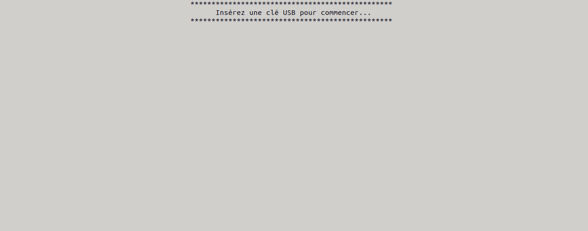

# virus-scan-kiosk-ansible

An ANSIBLE role to create a simple self service kiosk-scan station.

La station blanche est en français, parceque c'était le besoin dans mon cas.

The kisok is in French, because that was the need in my case. Won't be hard to translate if you want to do it.

## Usage

The kiosk boot on a this sreen 

When you plug an USB key, its content is automatically scanned by Clamav.

(Others antivirus can be added, see bellow)

## Install

Prepare the computer with Debian 11 and network connection.
On BIOS, disable boot From USB and disable warnings if keyboard is missing.

Apply the playbook on the computer.

## third-party code/parts

It's based on https://github.com/Crypt-0n/Station-blanche. It was put in the form of an ANSIBLE role, and some modifications in the Python script and in the way of mounting the USB keys.

The USBMOUNT package is provided here as a .deb for convenience. The sources are available on this repository https://github.com/rbrito/usbmount (No license)